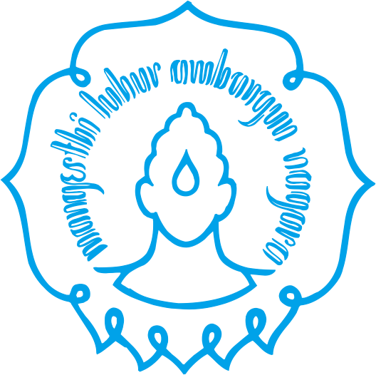

<p align="center">
  
</p>

<h1 align="center">Face Recognition — Eigenface Method</h1>

<p align="center">
  <strong>Kelompok 7 · Informatika 2025D · Universitas Sebelas Maret</strong>
</p>

<p align="center">
  
  
  
  
  
</p>

---

## 📑 Table of Contents

- [📖 Deskripsi Proyek](#-deskripsi-proyek)
- [🏗️ Arsitektur Proyek](#️-arsitektur-proyek)
- [⚙️ Cara Kerja Sistem](#️-cara-kerja-sistem)
- [📐 Rumus Aljabar Linier yang Digunakan](#-rumus-aljabar-linier-yang-digunakan)
- [🚀 Instalasi & Menjalankan](#-instalasi--menjalankan)
- [📘 Panduan Penggunaan](#-panduan-penggunaan)
- [🖼️ Tampilan Antarmuka](#️-tampilan-antarmuka)
- [🔧 Detail Teknis](#-detail-teknis)
- [📂 Dataset](#-dataset)
- [📄 Lisensi](#-lisensi)
- [👥 Anggota Kelompok](#-anggota-kelompok)

---

## 📖 Deskripsi Proyek

Aplikasi **Face Recognition** berbasis metode **Eigenface** yang dibangun menggunakan Python. Program ini mampu mengenali wajah seseorang dari gambar input dengan mencocokkannya terhadap dataset wajah yang telah dilatih sebelumnya. Seluruh komputasi aljabar linear (PCA, proyeksi eigenspace, dan pencocokan jarak Euclidean) diakselerasi menggunakan **PyTorch** sehingga mendukung eksekusi di **GPU (CUDA)** maupun **CPU**.

### ✨ Fitur Utama

- **Deteksi Wajah Otomatis** — Menggunakan Haar Cascade Classifier dari OpenCV untuk mendeteksi dan mengekstrak region wajah secara otomatis.
- **Eigenface Recognition** — Implementasi metode Eigenface dengan Power Iteration & Deflation untuk dekomposisi eigen secara manual (tanpa `numpy.linalg.eig`).
- **Akselerasi GPU (CUDA)** — Seluruh operasi tensor (mean face, eigenfaces, proyeksi, dan Euclidean distance) dijalankan di GPU melalui PyTorch jika tersedia.
- **Model Sharding** — Model yang telah dilatih dipecah menjadi beberapa file biner (~95MB/file) agar kompatibel dengan batas ukuran file GitHub.
- **GUI Modern** — Antarmuka desktop elegan dengan **CustomTkinter**, dilengkapi splash screen, navbar multi-tab, dan monitoring performa hardware secara real-time.
- **Report Otomatis** — Setelah analisis selesai, sistem secara otomatis men-generate laporan lengkap berisi metrik performa, statistik sistem (CPU/RAM/GPU), dan timeline snapshot.
- **Halaman Anggota Kelompok** — Menampilkan profil anggota kelompok dengan foto dan informasi akademik.

---

## 🏗️ Arsitektur Proyek

```
face-recognition/
│
├── main.py                        # Entry point aplikasi
├── LICENSE                        # Lisensi Apache 2.0
├── README.md                      # Dokumentasi proyek
│
└── src/
    ├── assets/                    # Aset gambar (ikon, logo, foto anggota)
    │   ├── logo_uns.png
    │   ├── logo_uns.ico
    │   ├── ic_*.png               # Ikon navigasi UI
    │   └── foto_member_*.jpg      # Foto anggota kelompok
    │
    ├── dataset/                   # Model Eigenface hasil training (sharded)
    │   ├── Eigen_Weight_0001.pt
    │   ├── Eigen_Weight_0002.pt
    │   └── ...                    # Total 16 file (~1.5 GB)
    │
    ├── test/                      # Dataset gambar uji (105 individu)
    │   ├── pins_Adriana Lima/
    │   ├── pins_Chris Evans/
    │   └── ...
    │
    ├── screen/                    # Modul antarmuka pengguna (GUI)
    │   ├── __init__.py
    │   ├── main_screen.py         # Dashboard utama (analisis wajah)
    │   ├── report_screen.py       # Layar laporan hasil analisis
    │   ├── group_screen.py        # Layar profil anggota kelompok
    │   ├── navbar.py              # Komponen navigasi atas (top navbar)
    │   └── splash_screen.py       # Splash screen saat startup
    │
    └── utils/                     # Modul utilitas dan logika inti
        ├── __init__.py
        ├── eigen.py               # Fungsi Euclidean Distance & Power Iteration
        └── train.py               # Script pelatihan model (CLI)
```

---

## ⚙️ Cara Kerja Sistem

### Alur Proses Eigenface

```
┌──────────────┐     ┌──────────────────┐     ┌────────────────────┐
│  Input Image │────▶│  Haar Cascade    │────▶│  Grayscale + Crop  │
│  (Target)    │     │  Face Detection  │     │  + Resize (50×50)  │
└──────────────┘     └──────────────────┘     └────────────────────┘
                                                        │
                                                        ▼
┌──────────────┐     ┌──────────────────┐     ┌────────────────────┐
│  Closest     │◀────│  Euclidean Dist  │◀────│  Project onto      │
│  Match       │     │  Comparison      │     │  Eigenface Space   │
└──────────────┘     └──────────────────┘     └────────────────────┘
```

1. **Deteksi Wajah** — Gambar input diproses melalui Haar Cascade untuk mendeteksi dan mengekstrak area wajah terbesar.
2. **Preprocessing** — Wajah yang terdeteksi dikonversi ke grayscale, di-crop, dan di-resize ke ukuran standar `50×50` piksel.
3. **Proyeksi Eigenspace** — Gambar di-flatten menjadi vektor, dikurangi mean face, lalu diproyeksikan ke ruang eigen menggunakan eigenfaces dari model.
4. **Pencocokan** — Jarak Euclidean antara vektor proyeksi gambar input dan seluruh vektor training dihitung. Jika jarak minimum lebih kecil dari threshold, wajah dianggap cocok.

### Pelatihan Dataset

Proses training menggunakan script `src/utils/train.py`:

1. Seluruh gambar dataset diproses dengan Haar Cascade untuk ekstraksi wajah.
2. Matriks gambar dibangun, mean face dihitung, dan matriks kovarian dibentuk.
3. Eigenvalue dan eigenvector dihitung menggunakan **Power Iteration + Deflation**.
4. Model (mean face, eigenfaces, projected faces, labels, dan gambar UI) disimpan sebagai checkpoint PyTorch.
5. Checkpoint dipecah menjadi partisi biner **@95MB** per file (sharding) agar kompatibel dengan batasan GitHub.

---

## 🚀 Instalasi & Menjalankan

### Prasyarat

| Komponen        | Versi Minimum    | Keterangan                                   |
|:----------------|:-----------------|:----------------------------------------------|
| Python          | 3.10+            | Direkomendasikan 3.11 atau 3.12               |
| PyTorch         | 2.0+             | Dengan dukungan CUDA (opsional, untuk GPU)     |
| CUDA Toolkit    | 11.8+ (opsional) | Hanya jika ingin akselerasi GPU                |

### 1. Clone Repository

```bash
git clone https://github.com/Dezkrazzer/face-recognition.git
cd face-recognition
```

### 2. Buat Virtual Environment

```bash
python -m venv venv

# Windows
venv\Scripts\activate

# Linux / macOS
source venv/bin/activate
```

### 3. Install Dependensi

```bash
pip install torch torchvision --index-url https://download.pytorch.org/whl/cu118  # Untuk GPU CUDA 11.8
# ATAU
pip install torch torchvision --index-url https://download.pytorch.org/whl/cpu     # Untuk CPU only

pip install opencv-python customtkinter Pillow psutil GPUtil
```

<details>
<summary>📋 <strong>Daftar Lengkap Dependensi</strong></summary>

| Package            | Kegunaan                                       |
|:-------------------|:-----------------------------------------------|
| `torch`            | Akselerasi komputasi tensor di GPU/CPU          |
| `torchvision`      | Utilitas tambahan PyTorch (opsional)            |
| `opencv-python`    | Deteksi wajah (Haar Cascade) & pemrosesan citra |
| `customtkinter`    | Framework GUI modern berbasis Tkinter           |
| `Pillow`           | Manipulasi dan rendering gambar di UI           |
| `psutil`           | Monitoring penggunaan CPU & RAM secara real-time |
| `GPUtil`           | Monitoring penggunaan GPU & VRAM (opsional)     |
| `numpy`            | Operasi array numerik (dependensi PyTorch)      |

</details>

### 4. Jalankan Aplikasi

```bash
python main.py
```

---

## 📘 Panduan Penggunaan

1. **Pilih Gambar Target** — Klik tombol **"Choose File"** pada sidebar untuk memilih gambar wajah yang ingin diidentifikasi.
   - **Note** — Jika ingin menganalisis foto yang sama seperti dataset, dapat pilih gambar melalui folder `src/test` (karena pada folder `src/test` berisi foto wajah yang digunakan untuk dataset).
2. **Atur Parameter** *(opsional)* :
   - **Tolerance Threshold** — Batas maksimum jarak Euclidean agar dianggap cocok (default: `3000.0`). Semakin kecil nilainya, semakin ketat pencocokan.
   - **Eigen Components** — Jumlah komponen eigen yang digunakan saat training (default: `50`).
3. **Mulai Analisis** — Klik tombol **"START ANALYZE"**. Sistem akan:
   - Memuat model dari file sharded (pertama kali) atau dari cache VRAM (eksekusi berikutnya).
   - Mendeteksi wajah pada gambar input.
   - Menghitung jarak Euclidean terhadap seluruh data training.
   - Menampilkan hasil pencocokan beserta persentase kecocokan.
4. **Lihat Report** — Setelah analisis selesai, sistem otomatis berpindah ke tab **Analysis Report** yang menampilkan laporan detail.

### Melatih Dataset Baru (CLI)

Jika ingin melatih model dengan dataset sendiri:

```bash
python -m src.utils.train
```

Masukkan path absolut ke folder dataset yang berisi subfolder per individu:

```
dataset_saya/
├── Orang_A/
│   ├── foto1.jpg
│   ├── foto2.jpg
│   └── ...
├── Orang_B/
│   ├── foto1.jpg
│   └── ...
└── ...
```

Model akan otomatis disimpan sebagai file sharded di `src/dataset/`.

---

## 🖼️ Tampilan Antarmuka

Aplikasi memiliki **3 halaman utama** yang dapat diakses melalui navbar:

| Tab                     | Deskripsi                                                                 |
|:------------------------|:--------------------------------------------------------------------------|
| **Analysis Dashboard** | Dashboard utama untuk memuat gambar, mengatur parameter, dan menjalankan analisis pengenalan wajah. |
| **Analysis Report**    | Laporan lengkap hasil analisis terakhir, termasuk metrik performa, jarak Euclidean, confidence, serta statistik penggunaan hardware. |
| **Anggota Kelompok**   | Profil anggota kelompok dengan foto dan informasi akademik.               |

---

## 📐 Rumus Aljabar Linier yang Digunakan

Berikut adalah rumus-rumus aljabar linier yang mendasari seluruh proses pengenalan wajah menggunakan metode **Eigenface** dalam proyek ini.

### 1. Membentuk Matriks Training

Kumpulkan seluruh citra wajah training berukuran **m × n** piksel. Setiap citra di-*flatten* menjadi vektor kolom berukuran **N = m × n**. Gabungkan seluruh **M** citra menjadi matriks training:

$$\Gamma = \{\Gamma_1, \Gamma_2, \Gamma_3, \ldots, \Gamma_M\}$$

Dimana $\Gamma$ adalah matriks berukuran **N × M** yang terdiri dari **M** vektor citra.

### 2. Menghitung Rata-rata Wajah (Mean Face)

Hitung vektor rata-rata dari seluruh citra training berukuran **1 × N**:

$$\Psi = \frac{1}{M} \sum_{i=1}^{M} \Gamma_i$$

### 3. Menghitung Matriks Selisih (Difference Matrix)

Kurangi setiap vektor citra training dengan vektor rata-rata untuk mendapatkan matriks selisih:

$$\Phi = \Gamma - \Psi$$

Dimana $\Phi_i = \Gamma_i - \Psi$ adalah vektor selisih untuk citra ke-$i$.

### 4. Menghitung Matriks Kovarian

Bentuk matriks kovarian dari matriks selisih:

$$C = \Phi \Phi^T$$

Dimana $\Phi = \{\Phi_1, \Phi_2, \Phi_3, \ldots, \Phi_M\}$.

> **Catatan:** Karena matriks $C$ berukuran **N × N** (sangat besar), dalam implementasi digunakan trik **surrogate covariance** $C' = \Phi^T \Phi$ berukuran **M × M** yang jauh lebih kecil, lalu eigenvector-nya diproyeksikan kembali ke ruang asli.

### 5. Menghitung Eigenvalue dan Eigenvector

Selesaikan persamaan eigen dari matriks kovarian:

$$C v_i = \lambda_i v_i$$

Dimana:
- $\lambda_i$ = **eigenvalue** ke-$i$
- $v_i$ = **eigenvector** ke-$i$

Dalam proyek ini, dekomposisi eigen dilakukan secara manual menggunakan algoritma **Power Iteration + Deflation** (tanpa `numpy.linalg.eig`).

### 6. Menghitung Eigenface

Hitung eigenface dari eigenvector yang telah diperoleh, lalu urutkan secara *descending* berdasarkan eigenvalue-nya:

$$\mu_i = \sum_{k=1}^{M} v_{ik} \Phi_k$$

Setiap $\mu_i$ merepresentasikan satu **eigenface** — sebuah "wajah basis" yang merupakan kombinasi linier dari seluruh selisih citra training.

### 7. Menghitung Vektor Fitur (Feature Vector)

Proyeksikan setiap citra training ke ruang eigenface untuk mendapatkan vektor fitur (bobot/weight):

$$\omega_k = U_k^T (\Gamma - \Psi)$$

Dimana $U_k$ adalah matriks eigenface terpilih (top-$k$ eigenface berdasarkan eigenvalue terbesar).

### 8. Proyeksi Citra Uji

Proyeksikan citra uji ke ruang eigenface dengan tahapan yang sama seperti citra training:

$$\Omega_k = U^T (\Gamma_{\text{uji}} - \Psi)$$

Dimana $\Gamma_{\text{uji}}$ adalah vektor citra yang akan diidentifikasi.

### 9. Pencocokan — Euclidean Distance

Bandingkan vektor proyeksi citra uji dengan seluruh vektor proyeksi citra training menggunakan **jarak Euclidean**:

$$\varepsilon_k = \|\Omega - \Omega_k\|$$

Citra training dengan jarak $\varepsilon_k$ **terkecil** dianggap sebagai hasil pencocokan. Jika $\varepsilon_k < \theta$ (threshold), maka wajah **dikenali**; jika tidak, wajah dianggap **tidak dikenal**.

### Ringkasan Alur Rumus

| Langkah | Operasi | Rumus |
|:--------|:--------|:------|
| 1 | Matriks Training | $\Gamma = \{\Gamma_1, \Gamma_2, \ldots, \Gamma_M\}$ |
| 2 | Mean Face | $\Psi = \frac{1}{M} \sum_{i=1}^{M} \Gamma_i$ |
| 3 | Matriks Selisih | $\Phi = \Gamma - \Psi$ |
| 4 | Matriks Kovarian | $C = \Phi \Phi^T$ |
| 5 | Persamaan Eigen | $C v_i = \lambda_i v_i$ |
| 6 | Eigenface | $\mu_i = \sum_{k=1}^{M} v_{ik} \Phi_k$ |
| 7 | Vektor Fitur | $\omega_k = U_k^T (\Gamma - \Psi)$ |
| 8 | Proyeksi Uji | $\Omega_k = U^T (\Gamma_{\text{uji}} - \Psi)$ |
| 9 | Euclidean Distance | $\varepsilon_k = \|\Omega - \Omega_k\|$ |

---

## 🔧 Detail Teknis

### Eigenface — Power Iteration & Deflation

Berbeda dari implementasi PCA konvensional yang mengandalkan `numpy.linalg.eig`, proyek ini mengimplementasikan dekomposisi eigen secara manual menggunakan algoritma **Power Iteration** yang dikombinasikan dengan **Deflation**:

```python
# Pseudocode
for setiap komponen eigen:
    v = vektor random awal
    for max_iter kali:
        v_baru = A @ v           # Iterasi perkalian matriks
        v_baru = normalize(v_baru)
        if konvergen: break
    eigenvalue = v^T @ A @ v
    A = A - eigenvalue * v @ v^T  # Deflation: hapus komponen yang sudah ditemukan
```

### Model Sharding

Karena model hasil training berukuran besar (~1.5 GB untuk 105 individu), file checkpoint PyTorch dipecah menjadi partisi biner dengan ukuran maksimum **95 MB per file**. Saat aplikasi dijalankan, seluruh pecahan digabungkan kembali secara sekuensial di RAM sebelum dimuat ke VRAM/CPU.

### Monitoring Performa Real-time

Sidebar dashboard menampilkan statistik hardware secara live (diperbarui setiap 1 detik):

- **CPU Usage** — Persentase penggunaan prosesor
- **RAM Usage** — Persentase penggunaan memori
- **GPU Load & VRAM** — Persentase beban GPU dan penggunaan VRAM (memerlukan `GPUtil`)

---

## 📂 Dataset

Proyek ini menggunakan dataset yang terdiri dari **105 individu** (selebriti & tokoh publik), dengan masing-masing individu memiliki beberapa gambar wajah. Dataset disimpan di `src/dataset/` dan digunakan untuk validasi serta pengujian akurasi.

---

## 📄 Lisensi

Proyek ini dilisensikan di bawah **Apache License 2.0**. Lihat file [LICENSE](LICENSE) untuk detail lengkap.

---

## 👥 Anggota Kelompok

<div align="center">

| No | Nama | NIM | Kelas |
|:--:|:-----|:----|:------|
| 1 | **Lazuardi Akbar Imani** | L0125105 | Informatika D |
| 2 | **Muhammad Haidar Ramzy** | L0125109 | Informatika D |
| 3 | **Egifrid Angelo Mwoleka** | L0125096 | Informatika D |

</div>

<p align="center">
  <sub>Fakultas Teknologi Informasi dan Sains Data · Universitas Sebelas Maret · 2025</sub>
</p>
